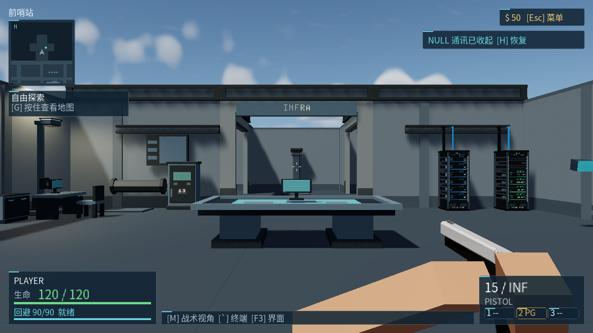
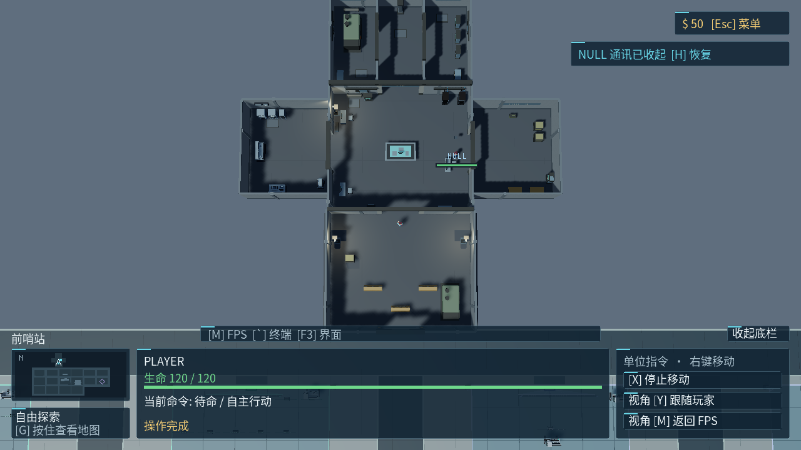
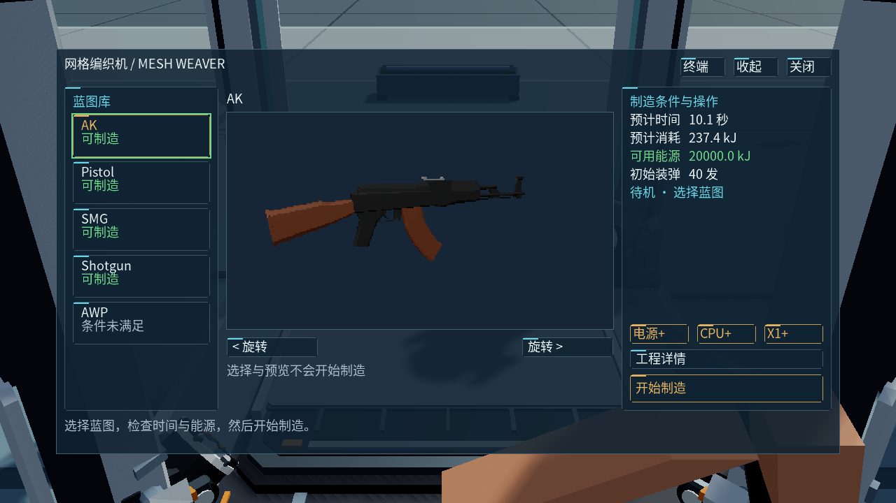
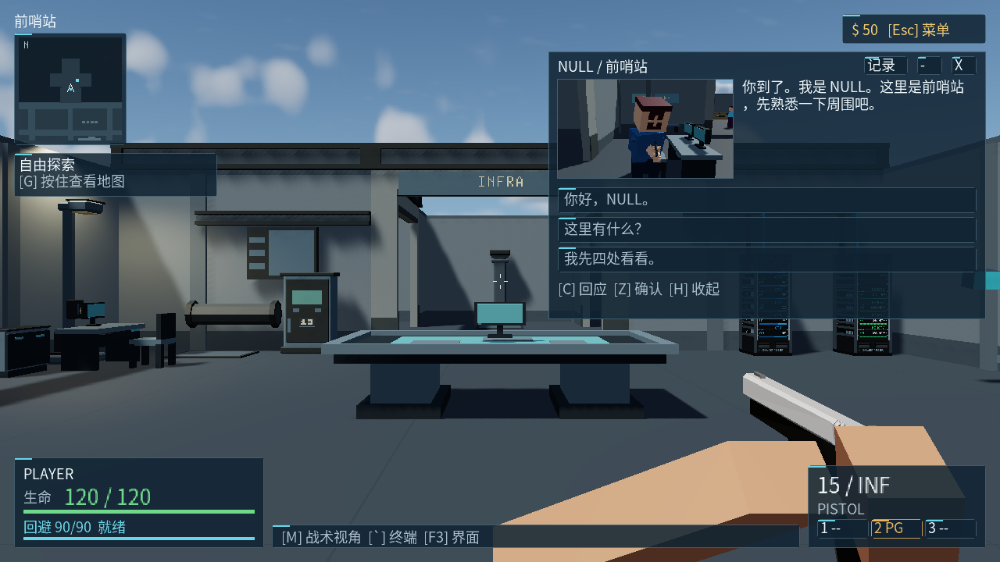
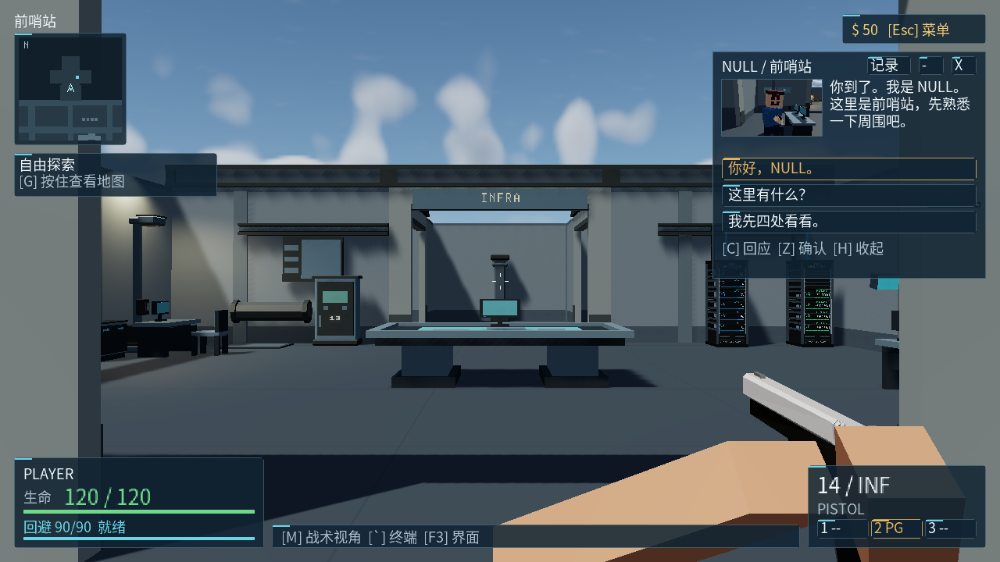
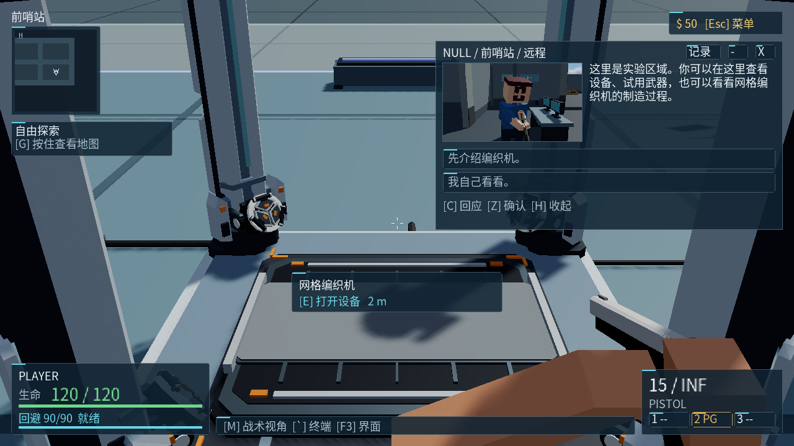
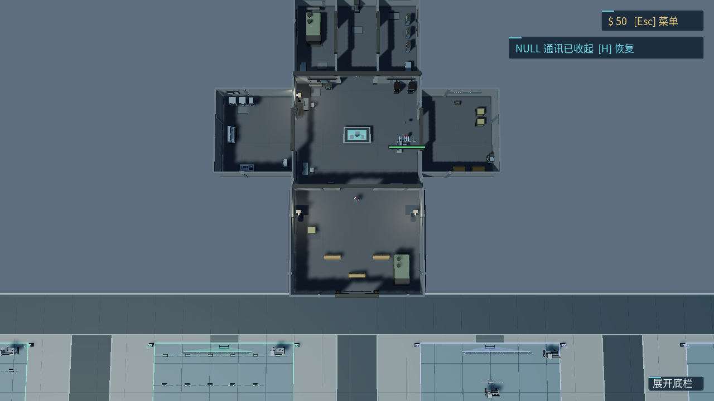
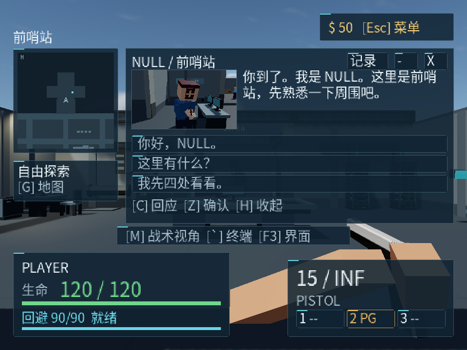

# 2026-10-04 Player UI V2 原生验收记录

> 状态：历史
> 归档原因：本轮原生验收现场证据，不是架构依据
> 当前设计：[玩家命令与展示](../architecture/player-commands.md)、[剧情与通讯](../architecture/story-and-comms.md)
> 任务来源：根目录 `Rasterfall_UI_v2_Codex_Development_Brief.md`

## 本轮交付范围

| 范围 | 实现状态 | 边界 |
| --- | --- | --- |
| 玩家、终端、实验三模式与偏好 | 完成 | 默认玩家模式；共享当前 session，不重建玩法 |
| FPS/RTS HUD、字体与共享地图 | 完成 | 主题、布局描述、地图变换独立；不投影未知敌人 |
| 编织机与通用设备窗口 | 完成 | 真实蓝图、模型、成本、制造、替换确认；渲染开关与指挥桌接共享服务 |
| GUI/终端命令统一 | 完成 | 权限、距离、世界代际、作业和会话版本在执行层校验 |
| NULL 自然待机与临时通讯约束 | 完成 | 保留正常动作计时；朝向目前采用身体平滑转向 |
| 真实实体镜头与两段分支通讯 | 完成 | 同一真实 NULL、低频完整小画面渲染、收起停止采样；两段共五个分支 |
| 剧情与任务持久化 | 完成 | 保存稳定 ID 与进度，重解析实体；不是完整游戏世界存档 |
| 视觉、输入与性能验收 | 部分完成 | 下表按实际路线记录；未穷举全部模式/选择组合及完整连续游玩路线 |
| 头颈/眼球独立注视、异步通讯渲染 | 延后 | 当前模型能力与同步路径限制明确；后续不需改剧情数据接口 |

使用入口见[玩家界面指南](../guides/player-ui-v2.md)。布局/主题、命令、地图、剧情和镜头的扩展职责见
[HUD 架构](../architecture/hud-effects.md)、[玩家命令](../architecture/player-commands.md)、
[剧情与通讯](../architecture/story-and-comms.md)。

## 实机截图

以下均为 Windows native GPU 捕获的完整画面，仅将 PPM 无损转为 PNG，没有绘制或补造界面。
720p FPS、RTS、编织机与普通通讯来自 build-6 的 `20261004-052637-873`；
紧凑通讯来自 build-5 的 `20261004-051215-499`，真实射击后弹匣为 14。
编织机截图等待真实模型预览 live-ready；早期连接占位图不作为交付截图。

远端 B 的补充截图来自 build-7；玩家位于实验区，视频显示前哨站的同一 NULL。

## 执行环境与证据范围

Windows 原生 PowerShell、MinGW/SDL、物理 GPU `gpu-scene`，1280×720。
执行入口为 `tools/gpu_player_ui.ps1`，通过真实 Win32 按键消息进入 SDL 和正常输入路由。
`RF_UI_AUDIT` 只观察状态，截图通过 capture request/ack 显式读回。每条路线等待进程真实退出并核对日志。
使用每次验收目录内独立的 UI/剧情存档路径，没有覆盖玩家日常存档。

下列三条通过路线使用同一 staged executable，SHA-256 为
`6C28E2DD17A36544753C4226BDECE13F775D15F9319A3F5224B64CEAD307D233`。
所有通过路线均为 `normal_sim=1`、`driver=0`，未使用制造时序注入或任务自动驱动。
Weaver 路线仅使用 `--gpu-normal-scene mesh-weaver 0` 的真实设备观察起点，后续选择、开工、断供、恢复与领取均为输入操作。
日志含 `SCENE-NATIVE bridges=0 mixed_execute=0`；进程退出码均为 0，无命中的 Vulkan validation/submit 错误。

| 路线 | 结果 | 本地证据根目录（仓库根相对路径） |
| --- | --- | --- |
| Outpost | PASS | `tmp/player-ui/interaction/20261004-043539-188` |
| Resume | PASS | `tmp/player-ui/interaction/20261004-043724-414` |
| Weaver | PASS | `tmp/player-ui/interaction/20261004-043758-434` |

各目录保留 `<Stage>.json`、stdout/stderr、截图请求与完成回执、`<Stage>-frames/*.scene.ppm`。
JSON 包含按键时间、逐帧状态、截图名称、exe hash 和真实退出结果；不提交这些生成物。

## 已执行路线

Outpost 从默认玩家模式进入真实前哨站通讯。F3 依次切换终端、实验、玩家模式，M 切换 RTS/FPS，
会话、节点和 session revision 保持一致。反引号打开终端后持续 W、Enter 与 `weaver status`，
角色位置、fire sequence、武器槽保持不变。H 收起后等待刷新稳定，确认隐藏期间 `video_frames` 不再增长；
恢复后真实辅助镜头继续更新。Z 回答第一分支，终端提交旧 revision 回答被错误码 4 拒绝，节点不变。
Z 显式确认末句后 A 完成、hold 释放。最后用 F3 选择终端模式后关闭进程，供 Resume 验证。

Resume 复用上述隔离存档启动新进程：mode=1、terminal=1、A=completed、task=201/running。
关闭终端并继续观察 90 多帧，story=0、queue=0、hold=0、link=0、video_frames=0，前哨站触发没有重播。
空闲实体镜头仍存在，因为其外壳是世界设备；这不等于通讯仍在播放。

Weaver 在终端选择 Pistol，再由 GUI 开工。serial 始终为 1；关闭面板后在终端执行断电与 status，
核对断电期间制造进度保持不变；恢复供电后原任务继续至 READY。READY 时 E 打开新设备面板，
第一次 Enter 返回替换确认码 8，第二次 Enter 明确确认已有武器替换，最终 collected=1、phase=0，
没有重复作业或射击输入。截图包含新设备页、终端断供、替换确认及领取结果。

## 持续输入、普通战斗通讯与重复显隐

`tmp/player-ui/interaction/20261004-051215-499` 的 BoundaryOutpost、BoundaryWeaver、BoundaryRender
三个进程全部 PASS、exit=0。exe hash 为 `C459D0035FAD06192A5B86B8227C48C52A3F907B02DF91760204B72D2D7F32F3`（build-5）。
这次鼠标使用真实 Win32 mouse event；发送按下前恢复目标窗口并严格确认前台 HWND 为本次 SDL 窗口，
失败即停止，finally 释放按键和鼠标。终端、通讯回答焦点、编织机和渲染面板中持续按住 W 与左鼠标，
按 Esc 关闭后仍保持按下再释放，位置与 fire sequence 均不变。

普通未回答通讯允许真实 S 移动，随后真实左鼠标令 fire sequence 从 0 变为 1、弹匣从 15 变为 14，
combat=1 时节点、session revision 和回答焦点保持原值。`BoundaryOutpost-frames/frame-000001.scene.ppm`
为此时紧凑通讯截图，已人工查看：视频保留真实 NULL 与周围场景，主视图仍为正在操作的同一世界。
这证明普通通讯不抢移动/射击输入；不把单张画面当成背景动态专项的证明。

`render status`、`table status`、`table maps`、`devices status` 均由真实终端输入执行，
`PLAYER-UI-COMMAND` 记录成功状态与非空输出，前后 render mask、table selection/pending 和会话不变。
远处 `table deploy campaign` 返回距离错误码 3，`comms reset 0` 返回权限错误码 2，均未改变真值。
F1 打开渲染设备后用方向键选择手电筒、Enter 将 render mask 从 6 变为 14；关闭后终端查询仍为同值。
该 F1 路线亦有 `20261004-051130-180` 独立 PASS，最终合并路线再次通过。

同一进程完成 12 次 H 收起/恢复，逐次核对隐藏刷新停止、恢复后辅助帧数增长。
前 2 次作预热，随后 10 次的原生进程 PrivateMemorySize64 从 1,357,967,360 增至 1,360,166,912 bytes，
增量 2,199,552 bytes（约 2.10 MiB），末值亦为区间采样峰值。这是短期进程私有内存观察，
没有测量 VRAM，不能据此宣称长时零增长或无泄漏。

## 修复与验收脚本调整

- 原 READY 状态按 E 会绕过新面板直接拾取，首次真实输入路线发现后修正为玩家模式优先打开新面板；上述 Weaver PASS 已验证修复。
- 初版脚本使用 WM_CHAR，现有终端实际消费逐帧 legacy key edges，改为逐字符按下/释放后通过。
- 初版 PowerShell 焦点等待捕获了与等待函数局部同名变量，改为独立的 prior frame/focus 后通过。
- 首次 All 的 Resume 被脚本误报：它错误要求空闲设备实体消失。改为检查通讯未重播、无 hold、隐藏视频零刷新；单独 Resume 已通过。该失败记录仍保留，不把首次 All 整体记作 PASS。
- 初版鼠标 PostMessage 在 SDL 相对鼠标锁下未驱动真实 buttons；改用原生 mouse event 后，以真实射击正例验证输入路径。默认沙箱鼠标定位与早期前台激活失败均安全停止，不纳入鼠标通过证据；上述 build-5 合并路线才是有效结果。

## 远端 B 的原生画面与实际实体距离

`tools/gpu_player_ui.ps1 -Stage Remote` 在 `tmp/player-ui/interaction/20261004-054106-218` 完整 PASS、exit=0。
exe SHA-256 为 `A47C8FCCACD87B57CB5B260547481A546E4717AE34FA3A33470F9F51A1364856`（build-7）。
使用真实 mesh-weaver 起点和正常模拟，未开启任务 driver、未发送开发跳节点命令；此起点直接进入
实验区域，所以 A 保持未触发，B 由真实区域检测启动。脚本也兼容先收到 A 时以真实 Z 输入完成 A 再等待 B。

同帧 `PLAYER-UI-AUDIT` 与 `PLAYER-UI-REMOTE` 读取运行中的身份与位置：玩家 `(68096,-32430)`，
NULL `(3686,-256)`、actor ID=2、actor generation=2、camera generation=1，水平距离约 **71998.71 RFU**。
B 的 story=102、node=1020、session/node revision 均为 2，link=live、video=live、camera_valid=1。
等待后辅助视频帧数持续增长，未回答的节点保持。真实 Z 输入选择“先介绍编织机”，进入 1021 并创建
task=203/running；再次 Z 显式结束后 B=completed、hold=0，任务仍 running，没有因关通讯而完成设备目标。

已人工查看两张 1280×720 原生截图：

- `Remote-frames/frame-000001.scene.ppm`：主视图为玩家身前的真实编织机，小视频为远处前哨站 NULL 与桌椅/终端背景。
- `Remote-frames/frame-000002.scene.ppm`：真实回答后的编织机指导、左侧任务简讯与地图目标标记；视频仍显示同一远处 NULL。

同目录另有仅格式转换的 `.scene.png` 便于浏览。记录验证了远程人物与环境的正确来源；没有把
帧数增长或两张截图进一步解释为 V14 背景动态专项已完成。

## NULL 根因、镜头与逻辑验证

旧实现永久为 NULL 设置 `control_disabled=1`，共享持枪姿态采样器以该值作为待机资格的一部分，
因而正常随机待机轮换被永久排除。移除此标志后，角色又会被 companion 策略要求跟随玩家。
修复使用独立 `ai_stationary` 驻地行为，并以 `movement_hold_token` 暂时限制通讯中的自主路径移动；
动作计时、普通 AI、受击等继续经过原系统。

新 `rf_story_logic_test` 的 native 独立驱动输出 `RF-STORY-TEST result=0`，覆盖两段剧情全部五个分支、
队列去重、combat 延后、过期/重复/无效回答、收起恢复、事件任务、保存加载、损坏文件拒绝、
actor generation 复用、受击/镜头失效释放、正常待机轮换和动画推进。
完整 Windows NativeCodex 逻辑聚合亦通过；最终构建版本及日志见下方集成补证。

真实 `outpost.map` CPU probe 已验证前哨站触发、`experiment` 区域触发远端 B，以及真实 mesh_weaver 目标。
镜头 profile `null_comms` 的首个合法机位为 `(3686,-76,744)`，朝向真实 NULL，投影 near=64/fov=67 与 GPU 一致。
候选光路按真实碰撞检查，不把镜头放进障碍物。进入 labs 后仍绑定同一真实前哨站 NULL。

注视目前为**平滑身体朝向**，没有独立头颈/眼球 look-at。通讯镜头固定；不每帧绕人物追踪。
距离、偏移、眼高与俯仰集中在可扩展 profile 表。新近镜头的 Outpost 实机截图显示完整头部与半身、真实周围场景；
远端视频已由上面的原生路线补证；场景背景动态专项仍需单独观察，不能用 CPU probe 替代。

## V01–V16 范围核对

本表合并本轮各条实际执行路线。部分覆盖不等于整项验收通过；版本、视觉与性能证据分别在正文列明。

| 项目 | 本次实证范围 | 状态 |
| --- | --- | --- |
| V01 | 默认玩家模式、模式保存与新进程恢复；缩放配置逻辑与 150% 原生布局通过，未组合执行缩放后重启 | 部分通过 |
| V02 | F3 三模式与 FPS/RTS 切换保留同一通讯；制造与模式组合未穷举 | 部分通过 |
| V03 | GUI 开始、终端查询/断供/恢复、GUI 确认领取同一 serial | 已测路线通过 |
| V04 | 终端 W/Enter、终端/通讯焦点/编织机/渲染面板持续 W+真实鼠标跨关闭无穿透；主动失焦专项未执行 | 部分通过 |
| V05 | 1280×720、1920×1080、960×720/150% 图检；窄窗任务卡修正后复拍；720p RTS 底栏真实输入路由收起/恢复 | 已测尺寸与路线通过 |
| V06 | 共享地图正逆变换回归、真实地图目标 CPU probe、FPS/RTS 实机显示；未单独录制同一点往返点击路线 | 逻辑通过，实机部分覆盖 |
| V07 | 未执行所有选择组合 | 未测 |
| V08 | 编织开始、关闭面板、断供、恢复、完成、一次领取及替换确认 | 已测路线通过 |
| V09 | 逻辑测试证明 NULL 继续正常待机轮换；无通讯长时实机观察未在此执行 | 部分逻辑证据 |
| V10 | 实机 live/收起/恢复/完成释放；逻辑覆盖受击、镜头失效与 generation | 部分通过 |
| V11 | 实机第一分支、跨进程不重播；逻辑覆盖 A 全部分支与事件去重 | 部分通过 |
| V12 | 原生远端 B live 视频、真实 NULL/背景、实际 actor 距离约 71999 RFU、weaver 指导与地图目标截图 | 已测路线通过 |
| V13 | 通讯中 FPS/RTS、终端、过期回答，以及普通移动/真实射击与紧凑画面保持同一节点 | 已测路线通过 |
| V14 | 视频隐藏停止刷新/恢复更新有帧计数；背景可见变化未在此独立验收 | 部分通过 |
| V15 | 逻辑覆盖 actor 槽复用、镜头失效、受击与坏档；跨进程完成状态恢复实机通过 | 部分通过 |
| V16 | 12 次显隐刷新核对通过，预热后 10 次进程私有内存约 +2.10 MiB；不是 VRAM 或长时泄漏测量 | 部分通过 |

## Linux 辅助构建尝试

本机存在 WSL Debian。普通 `make rasterfall` 辅助构建在 freestanding C 编译阶段失败，
`rf_game_runtime.o` 与 `rasterfall_render.o` 没有生成成功。已读日志包括现有 renderer include 中的
`free`、`qsort`、`getenv`、`calloc` 声明缺失；新增模块对象尚未全部生成，不能声明 Linux 构建通过。
没有运行 bootstrap 更新、编译器回归或 WSL GPU 验收。构建退出后，额外确认 make/gcc/cc1/as/ld 均无残留。
由于此构建与 native 性能 pilot 时间重叠，该段 pilot 不用于正式 CPU/wall 性能结论；正式采样须在构建停止后执行。

随后限定本轮新增的八个对象，以直接 GCC `-Wall -Wextra -Werror` 单独编译，全部通过且 stderr 为空。
证据为 `tmp/player-ui/linux-new-strict.stdout.log` 与 `linux-new-strict.stderr.log`。
本轮修复限于新 UI 源文件使用 Tinylibc umbrella header，避免误引宿主 stdio，以及两个命令逻辑测试
改用公共 `tlibc_malloc/tlibc_free` 并显式清零。没有扩改历史 renderer 或公共 libc。
此结果证明新增单元可编译；仍不代表 Linux 完整可执行文件构建或运行通过。

## 视觉与性能补充

Windows 完整逻辑聚合在 `tmp/ui-v2/test-3.log` 与 `test-4.stdout.log` 均退出 0；
后者直接运行已 stage 的新字体/设备服务版本，避免改写正在执行视觉检查的 package。
覆盖共享地图变换、布局、字体缓存、玩家命令、设备命令和剧情，并保留原玩法/session 回归。
`build-4b.log` 构建退出 0、无编译警告；字体缓存检查通过，包含 7544 个字形。

720p 新 FPS、RTS、通讯与制造机已经原生捕获。高 DPI 下曾发现“请求窗口尺寸”和实际渲染尺寸不一致，
后续已使用 SDL permonitorv2 并检查 PPM 输出宽高，不把 Win32 client 尺寸直接当成 GPU 分辨率。
性能独占运行，与构建分时；曾与 WSL 全核编译重叠的一轮 pilot 作废，不纳入正式对照。
正式视觉与性能数据已分别补入，截图读回期间的帧耗时不作性能结论。

## 辅助镜头 GPU 与正式性能采样

`RF_GPU_AUX_TEST=1` 的 native 定向回归输出 `Scene graphics: PASS checks=23`，验证真实离屏目标更新、
GPU 合成、HUD 覆盖顺序、隐藏、资源复用、暗蓝灰清屏色，以及辅助 owner 无像素读回和 bridge。
完整 graphics 回归在增加清屏色检查前曾通过 7118 项；清屏色及最终辅助路径以这次 23 项定向检查为准。
这些测试验证设备合同，不能代替真实 NULL 构图、背景变化或长时显存稳定性验收。

正式证据位于 `tmp/player-ui/performance-final/config.json`、`report.json` 和各项 `r*-*.out/.err`。
执行 `tools/gpu_player_ui_perf.ps1 -Rounds 2 -Samples 360`，每项预热 120 帧，第二轮反转顺序；
20 个独立 native 进程均退出 0，`SCENE-PERF` 与 `UI-PERF` 均为 `valid=1`，每项完整获得 360 帧。
所有 profile 的日志实际 `extent=1280x720`，`present_mode=0`（immediate），120 FPS 上限、实时时钟、
固定 sky time 0/scale 4、实验展示关闭。采样未开启 capture、逐帧 UI 审计或 Vulkan validation layer，
期间无并行 GPU 工作、编译或图像转码。没有命中提交或 validation 错误日志；这不等于启用了验证层。

本次主机 CPU 为 AMD Ryzen 5 5600H with Radeon Graphics，日志报告 6 个物理核心、14188 MiB 内存。
Vulkan 枚举 NVIDIA GeForce RTX 3050 Laptop GPU（vendor `10de`、device `25e2`、原始 driver `2584608768`、
API `4211039`）与 AMD Radeon(TM) Graphics（vendor `1002`、device `1638`、原始 driver `8388841`）。
未设置厂商覆盖；根据后端默认优先独显策略，本轮使用 RTX 3050。原始日志记录枚举列表，没有单独输出选中设备名。

采样 exe SHA-256 为 `B3C0C25510E88E57FA6A18E2B53C8089B4747F85F0FCBD3B056AF0B4686A47B7`，
对应 build-4b，已含玩家 HUD、字体缓存、真实预览及通讯；后续 render/table 玩家窗口壳的 build-5 不在这份性能样本内。
地图、content、武器模型与蓝图哈希同时保存在 config，脚本退出前复核未变化。
对照是**同一 exe 的 experiment 兼容界面**，不是改动前二进制。
旧 exe 已被后续 stage 清除；`tmp/ui-v2/baseline-weaver/config.json` 与 `report.json` 只保留原版 Weaver
一轮 120 帧、quarter 视角的 absent/idle/active 参考（旧 exe hash `94768AE50CE9617271FF2CABAFF475AF6F40E51974D2D61BEB4E6668A9E417CF`），
负载与镜头不同，不能据此计算 UI V2 的前后提升。

下表单位为毫秒，范围表示两轮各自分位数的最小值至最大值，未把两轮样本混成一个分位数。
GPU 列只含主视图 GPU 时间戳；prepare 是 CPU 准备阶段墙钟。

| profile | 帧 p50 | 帧 p95 | 主 GPU p50 | 主 GPU p95 | prepare p50 |
| --- | --- | --- | --- | --- | --- |
| experiment-fps | 8.379–8.397 | 8.730–8.825 | 1.691–1.915 | 1.972–2.009 | 2.199–2.262 |
| player-fps | 8.403–8.416 | 9.238–9.632 | 1.712–1.970 | 2.016–2.042 | 2.655–2.749 |
| experiment-rts | 8.395–8.398 | 9.259–9.287 | 2.011–2.013 | 2.080–2.107 | 2.642–2.751 |
| player-rts | 8.395–8.398 | 9.789–10.068 | 1.786–2.037 | 2.090–2.126 | 3.225–3.345 |
| weaver-preview | 8.385–8.404 | 9.187–9.395 | 2.017–2.018 | 2.150–2.171 | 2.916–3.097 |
| comms-visible | 8.411–8.434 | 13.668–15.113 | 2.088–2.165 | 2.142–2.207 | 3.232–3.257 |
| comms-hidden | 8.396–8.417 | 9.063–9.546 | 1.702–1.971 | 2.005–2.055 | 2.696–2.810 |
| comms-closed | 8.416–8.424 | 9.342–9.421 | 1.702–1.927 | 2.015–2.066 | 2.610–2.715 |
| comms-remote | 8.395–8.400 | 13.188–13.244 | 2.172–2.185 | 2.223–2.282 | 2.948–3.018 |
| comms-remote-hidden | 8.430–8.466 | 9.968–10.132 | 1.988–2.188 | 2.218–2.225 | 2.963–3.008 |

辅助视图仅统计实际更新帧，内部大小 320×180、目标刷新 12 Hz。远程路线在真实实验区，主玩家距离 NULL
超过 10000 RFU，保持同一前哨站实体镜头；每帧不重新伪造剧情或摄像机状态。

| 辅助负载 | 每轮更新次数 | 更新墙钟 p50 | 更新墙钟 p95 | GPU p50 | GPU p95 |
| --- | --- | --- | --- | --- | --- |
| 真实武器预览 | 37 / 36 | 0.839–0.843 | 0.933–1.098 | 0.462–0.463 | 0.490–0.493 |
| 近处真实通讯 | 37 / 39 | 5.713–6.258 | 6.964–8.356 | 1.826–1.905 | 1.879–1.935 |
| 远程真实通讯 | 36 / 38 | 5.447–5.451 | 6.227–6.476 | 1.622–1.632 | 1.665–1.707 |

近处收起、关闭和远程收起各两轮均为 `aux_samples=0`；恢复更新与完整结束的行为另有输入路线证据。
辅助更新墙钟包含同步 GPU 退休等待，不是纯 CPU 运算时间，也不能与主 GPU 分位数相加。
`SCENE-CPU` 记录的主线程操作系统 CPU 时间受 Windows 记账粒度影响，各项 p50=0、p95=15625 µs，
不能据此声称 CPU 成本为零。本轮有用的准备阶段证据是 player FPS 的 prepare p50 比对应 experiment
增加约 0.39–0.55 ms，RTS 增加约 0.58–0.59 ms。120 FPS 限帧掩盖了中位帧间隔差异，不能据 p50 接近判断无开销。
真实通讯更新会使帧 p95 升至约 13–15 ms；该同步路径存在可观测尾延迟，尚未进行异步多槽优化。

`tmp/player-ui/performance-pilot/evidence-notes.json` 明确将与 WSL 全核构建重叠的 pilot 性能判为无效，
只保留其状态检查；隔离复查 `tmp/player-ui/performance-rts-isolated/report.json` 的两轮 180 帧 RTS
确认异常并非稳定回归。正式报告采用构建停止后的独占采样，不混入 pilot。
本次没有长时显存增长、不同 GPU/驱动或最终 build-8 性能全矩阵证据；早期 720p Weaver 的首帧仅显示连接占位。
本文交付画廊已使用后续等待 live-ready 的真实武器截图补证，不采用早期占位图。

## 世界部署失败预检补证

独立 native 驱动编译当前 `rf_game_lifecycle.c` 并执行 `rf_game_world_request_logic_test()`，输出
`WORLD-REQUEST PASS checks=9`、`RF-WORLD-REQUEST-TEST result=0`；编译使用 `-Wall -Wextra -Werror`。
缺失地图、误传蓝图 JSON 和非法 world ID 均拒绝，测试比较原 session 全字节与完整剧情状态，确认 world
generation 和 movement hold 未变；真实 outpost 的独立预检成功并释放临时资源。
这是正式重建前的失败保护，不代表两次加载之间文件变化或第二次内存分配失败已有事务回滚。

## 最终集成与布局补证

build-8 的源码包含最后的窄窗任务卡排版修正。staged exe SHA-256 为
`99D30CA2F1CCC9C9B0331B842822DF00534DC4D2DC69940B4C1F6B3955C2E981`。
直接启动该 exe 的 `--logic-test`，以 Windows Process handle 等待退出并读取真实 ExitCode=0；
stdout/stderr 分别为 `tmp/ui-v2/test-8-direct.stdout.log`、`test-8-direct.stderr.log`。
新命令 42 项、设备命令 21 项和世界预检 9 项均通过，原玩法、session、地图、绘制与动画回归亦完成。
stderr 的两条缺图/错误格式来自明确的失败保护负例，不是未处理的测试失败。
早期 `NativeCodex.ps1 test` 的 test-6/test-8 日志被 PowerShell 5.1 把该 stderr 包装为
NativeCommandError，不能将其包装进程退出码当作成功。`Invoke-Staged` 现将原生诊断转为普通文本，
保留实际进程退出码，并恢复原错误偏好；stderr+exit 0/7 的最小探针均正确传递。
修正后完整 `NativeCodex.ps1 test` 再次运行，`tmp/ui-v2/test-9.log` 对应工具退出 0，预期失败诊断保留，
没有 NativeCommandError 包装；没有修改游戏来隐藏负例。
test-9 以相同游戏源码重新链接并暂存，最终 exe SHA-256 为
`B85FE5A5E73BD75FAE1DCA985885D4887C2AE33AC90F002BF93ACECFFEDC8F63`。

尺寸与构图由实际 PPM 宽高、审计状态及人工逐图检查共同确认：

| 证据目录（`tmp/player-ui/layout/` 下） | 实际范围 |
| --- | --- |
| `20261004-050215-486` | build-5，1920×1080，100%，FPS/RTS、通讯、终端、渲染与设备窗口 |
| `20261004-052637-873` | build-6，1280×720，100%，五张核心交付图中的 FPS/RTS/编织机/普通通讯 |
| `20261004-052714-685` | build-6，960×720，150%，设备、终端、RTS 与通讯；后续审查发现任务卡右沿被通讯覆盖 |
| `20261004-053956-374` | build-7，720p，底栏收起/恢复实际命中且 PLAYER 选择保持 |
| `20261004-054612-006` | build-8，960×720，150%，任务卡与地图同列，简短地图提示，通讯选项与底部状态均可读 |

RTS 点击测试使用前台 HWND 守卫、真实光标定位及 Win32 窗口消息；首个激活点击没有进入 SDL，
只在缺少 `PLAYER-UI-POINTER` 边沿时有界重试一次。最终 `HIT=4/dock=0` 与 `HIT=4/dock=1`
对应收起和恢复，截图确认结果。此前未产生事件的鼠标投递不作为按钮失败或通过证据；
这条窗口消息路线与前文边界测试的真实全局 mouse event 路线分别记录。

