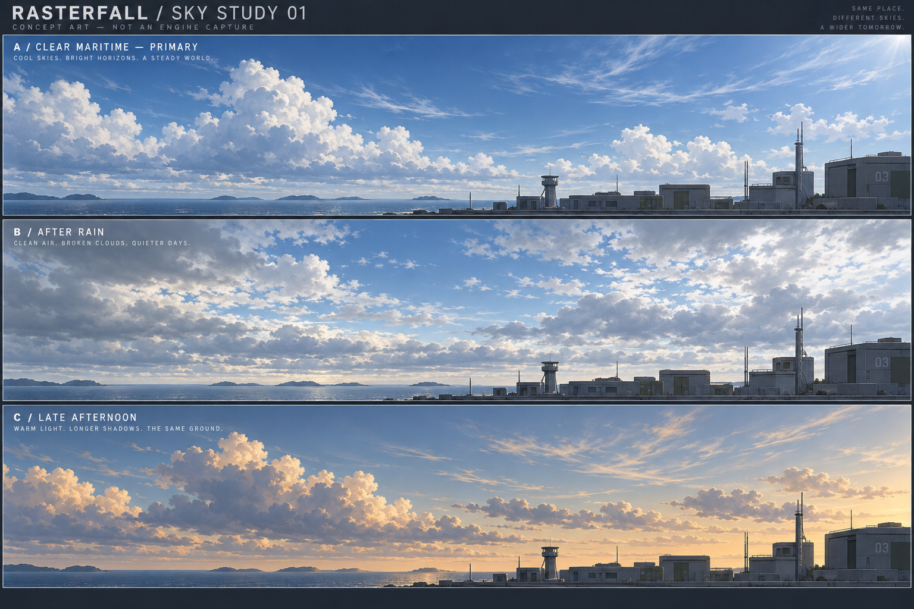

# RF 天空 V2 设计研究

> 状态：设计研究；GPU 首版实现与剩余边界见当前架构
> 所有者：Rasterfall 环境美术 / GPU Scene
> 调研日期：2026-10-02

## 目标与方向

用户目标是更高级、略微写实且适配 RF 整体艺术风格的新一代天空。
建议默认采用「清透晴空」：冷蓝天顶、珍珠蓝地平线、暖白积云、灰蓝云底与少量高空卷云。
写实感来自厚度、光照和空气层次；构图遵守 RF 的低饱和工业环境与动漫角色搭配，保留大块留白。
约束依据为[环境艺术合同](environment-art.md)，技术基础为[GPU 光照架构](../architecture/gpu-lighting.md)。

这是第一轮美术和技术设计研究，以下现状清点描述研究时的旧实现。后续已开始接入独立 GPU 天空，
当前事实以[GPU 天空架构](../architecture/gpu-sky.md)与[验证指南](../guides/gpu-sky.md)为准；本研究不代表性能或美术验收。执行优先级仍由
[唯一活动计划](../plans/README.md)管理。

## 已核对的现状

- `rasterfall/src/rasterfall_sky.c`：按俯仰计算屏幕地平线，绘制八档蓝色色带、暗色下半球和三个固定方向的矩形云。
- `rasterfall/src/render/rf_gpu_scene_layers.inc`：SKY 仍调用共享 `rasterfall_sky_layout`，将 canvas 矩形发射为 Scene 几何。
- `gpu/src/rf_gpu_lighting.inc`：已有太阳方向、颜色、环境填充与曝光；太阳默认方向约为 `(-0.408, 0.816, -0.408)`。
- `gpu/shaders/graphics_scene.frag` 与 `graphics_tonemap.comp`：Scene 已使用线性光照与 HDR 后处理。
- 当前天空没有云体厚度、太阳一致的云受光、连续大气散射或天气参数。主要瓶颈是表达模型，单纯增加色带与矩形数量不足以满足目标。

## 概念对照

图像由内置 imagegen 生成，仅用于美术方向讨论；不是 RF 实机截图、360° 全景、HDR 贴图或可直接使用的 cubemap。
图中的海岸、远山及建筑不构成地图改造要求。实际实现应比图中进一步减少碎云和地平线细节，
并以真实前哨站、角色和敌人同框验证风格。

| 方向 | 视觉意图 | 用途与取舍 |
| --- | --- | --- |
| A 清透晴空（推荐） | 中低饱和冷蓝、温和暖白云顶、灰蓝云底、大块蓝天 | 默认前哨站；明快、有空间感，优先保证敌人轮廓 |
| B 雨后初晴 | 较多层积云、云隙透蓝、银灰远空 | 同一系统的多云变体；防止云底过黑使地面像被错误打亮 |
| C 午后暖光 | 上空保留冷蓝，迎光云缘淡杏色，远空柔暖 | 气氛变体；太阳方向、地面阴影与曝光必须一起匹配 |

美术起点（屏幕参考色，不直接用作线性辐射值）：天顶 `#477BA8`、远空 `#BCD0DC`、
云顶 `#F3F0E7`、云底 `#8498AC`。实际颜色要经过同一曝光与色调映射后调校。
默认候选云覆盖约 30–45%，作为构图起点而非固定测试值；稀薄卷云只补层次。

### 形体与运动

- 大尺度先形成几组不对称云群，中尺度表现隆起与厚度，小尺度只修云缘；避免满屏等尺寸棉花团。
- 云底较平、云顶有生长方向，远处云群在透视与薄霾中合并；地平线不堆成连续白墙。
- 迎光侧有柔和亮缘，背光侧仍保留天空填充；避免烤焦云底、描边式银边和过曝成纸白的整朵云。
- 风向稳定、漂移缓慢；云形不随相机旋转游动，不逐帧重抽随机数。默认固定日照时刻，先建立稳定美术基准。
- 下半球平滑过渡到低饱和远景底色；不在天空贴图中烘焙近处建筑、山体或海岸，避免 RTS 高视角暴露错误透视。

## 一手参考与取舍

| 来源 | 已确认内容 | RF 采用的设计启发 |
| --- | --- | --- |
| [Hillaire 2020 作者资料](https://sebh.github.io/publications/)与[作者示例](https://github.com/sebh/UnrealEngineSkyAtmosphere) | 作者提供大气渲染研究、演讲及示例实现 | 大气与太阳统一，以查找表降低重复计算；分开天空与世界空气透视 |
| [Guerrilla 2015 云系统](https://www.guerrilla-games.com/read/the-real-time-volumetric-cloudscapes-of-horizon-zero-dawn) | 云形可控、多云型、随光照变化及预算导向的体积云设计 | 先控制云群分布和厚度，再加细节；云建模、运动、光照分别控制 |
| [Guerrilla 2022 Nubis Evolved](https://www.guerrilla-games.com/read/nubis-evolved) | 讨论近距离云、快速运动和时间重建伪影等问题 | RF 首版聚焦远景天空；近云穿行和风暴不是当前必要成本 |

以上来源用于原理研究，不导入商业游戏截图或资源。Hillaire 大型论文 PDF 本次网页抓取失败，
未宣称逐页审阅；依据为作者入口与示例仓库。第三方的性能数字不作为 RF 性能承诺。

## 推荐技术方案（待实现）

采用独立 GPU 天空系统：大气背景、太阳、主积云层、高空薄云分别求值，在线性 HDR 合成。
把「天空盒」作为用户侧概念；实现不限定为六张静态图片。

| 路线 | 优点 | 主要限制 | 定位 |
| --- | --- | --- | --- |
| 固定 HDR cubemap | 成本稳定、易锁定美术 | 太阳与云光照固定，动态与天气变化受限 | 低成本对照或降级候选 |
| 程序大气＋分层二维云 | 易迭代、资源轻 | 天顶与低仰角容易显出薄片感 | 原型和较低质量档 |
| 程序大气＋远景体积积云＋高云 | 厚度、遮光与太阳响应自然 | 增加 GPU 时间、目标资源和采样稳定性工作 | 推荐正式目标 |

### 数据和接入边界

1. 建立展示侧天空参数：太阳方向、太阳辐射、浑浊度、云量、云底/厚度、风、种子与冻结时间。
   由 Scene 帧按值冻结；不进入 `toy_game`、碰撞或网络权威状态。天气联机同步若以后需要另立合同。
2. 太阳方向必须直接与 `rf_gpu_lighting` 共享，先核对向光向量的符号、Y-up 和相机 yaw/pitch。
   固定时间时，太阳盘、云亮面和地面投影不得各用独立常量。
3. GPU 从相机方向与投影重建视线，天空跟随旋转；远景模式不因玩家在实验区平移发生明显视差。
   不使用旧 canvas 矩形云继续承载高级天空。
4. SKY pass 写入现有 HDR 目标，遵守 reversed Z 与 WORLD 遮挡。天空不写 WORLD 深度；
   透明玻璃、特效和 viewmodel 在正确层次上合成，HUD 仍在色调映射之后。
5. 云初版采用固定种子与稳定采样；先建立全分辨率参考，再评估半分辨率目标、上采样与空域滤波。
   引入时间累积时必须处理转头、resize、切地图和相机跳变的历史失效，不能只凭静态截图选择算法。
6. 大气查找表按大气/太阳/观察条件分别失效；云随冻结展示时间变化。GPU slot 拥有资源、描述符与退休生命周期，
   静态 WORLD 缓存不应因云飘动重建；常规帧无 CPU readback。
7. 地平线天空薄霾与世界空气透视是不同消费者。第一版只调整天空，不把整屏白色遮罩当成空间雾。
   环境填充可随预设调校，但不得把这种颜色调整称为 IBL；地面云影也需独立实现与验证。

GPU 独立发展符合当前光照架构。CPU 继续使用现有天空；CPU 风格对齐可另设低成本实现，
不把体积云计算塞入共享 CPU canvas。新增 shader、编译单元与资源时同时检查根 Makefile、
Windows 构建、shader 打包和 package 复制入口。

### 性能目标与降级

候选预算：在指定 Windows 物理 GPU、1920×1080、相同场景与固定曝光下，
天空 GPU 增量以约 1 ms 为调优目标、2 ms 为降档评审线；这是设计目标，尚未实测。
同时记录整帧 CPU/GPU 时间、p50/p95、资源占用与首次创建成本，避免将降低帧率误归于云 shader。
优先降低云采样与分辨率，保持太阳一致性、稳定轮廓和大气渐变；无法达标时评估分层云档。

## 实机验收条件

- 前哨站 FPS 平视、仰视、太阳方向与背太阳方向；同一角色/敌人在亮云和蓝天前仍可辨识。
- 连续水平转满一圈、天顶、大俯仰与 RTS 俯视：无接缝、极点捏缩、云片突然消失或屏幕空间锁定。
- 慢走与快速转头：无噪点闪烁、拖影和层间滑动；固定种子/时间时可重复捕获。
- 建筑屋檐、细杆、透明玻璃、枪械与 HUD：无天空穿透或边缘亮晕，室内曝光不被天空异常拉动。
- 固定曝光对照旧版：渐变连续、暖白云不大面积裁白、云底有层次；A/B/C 使用一致的色彩管理。
- Windows native 连续提交、resize、最小化/恢复与地图切换无资源错误；退出码与完整日志共同作为证据。
- 自动化只覆盖稳定契约，如相机方向、太阳一致性、有限数值和 GPU 资源生命周期；云的临时轮廓和具体覆盖率不写死成测试。

## 概念生成记录

使用内置 imagegen，单次生成三联对照图；完整提示词保存在
[生成提示词](sky-v2-study-01-prompt.txt)。图像是设计研究附件，不进入游戏资源或 package。
本轮完成资料调研、源码接入点核对和美术概念；未修改运行时、未运行构建或声称实机视觉验收。
